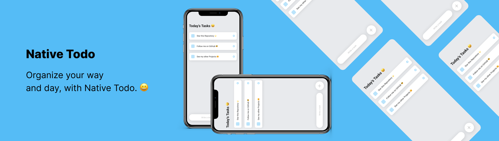

<h1 align="center"> Native Todo </h1>

<p align="center">
Organize your way and day, with Native Todo. <br/>
</p>

<p align="center">
  <a href="#-technologies">Technologies</a>&nbsp;&nbsp;&nbsp;|&nbsp;&nbsp;&nbsp;
  <a href="#-about">About</a>&nbsp;&nbsp;&nbsp;|&nbsp;&nbsp;&nbsp;
  <a href="#-layout">Layout</a>&nbsp;&nbsp;&nbsp;|&nbsp;&nbsp;&nbsp;
  <a href="#-installation">Installation</a>
</p>

<p align="center">
  
</p>

## 🚀 Technologies

This project was developed with the following technologies:

- ``React Native`` & ``JavaScript``
- ``Git`` & ``Github``
-  ``Figma``

## 📖 About 

### Description
A simple React Native app, where you can create custom tasks and delete them width a simple and friendly UI, easy to use.

### Objective
Learn and practice the following languages: React Native, JavaScript, and the design platform Figma. 

## 🔖 Layout

You can view the layout of the project through [in here](https://www.figma.com/file/PrBiS30nIdMFRhPAjfI9uz/Native-Todo?node-id=0%3A1&t=cyj9RvMbv0wZ5QXU-1). You must have an account at [Figma](https://figma.com) to access it.

## 🛠 Installation

```javascript
# Clone this repo:
git clone https://github.com/devgoncalo/native-todo

# Entry in folder
cd native-todo

# Install deps with npm or yarn
npm install | yarn

# Launch the app on android with react-native or yarn
react-native run-android | yarn android

# Launch the app on ios with react-native or yarn
react-native run-ios | yarn ios

```

## 📫 Contribute
To contribute to Native Todo follow these steps:
1. Fork this repository.
2. Create a branch: `git checkout -b <branch_name>`.
3. Make your changes and commit them: `git commit -m '<commit_message>'`
4. Push to original branch: `git push origin <project_name> / <location>`
5. Create the pull request.
Alternatively, see the GitHub documentation at [how to create a pull request](https://help.github.com/en/github/collaborating-with-issues-and-pull-requests/creating-a-pull-request ).

## :memo: Licence

This project is licensed under the MIT license.

---

Made with ♥ by [Gonçalo Pinto](https://github.com/devgoncalo)